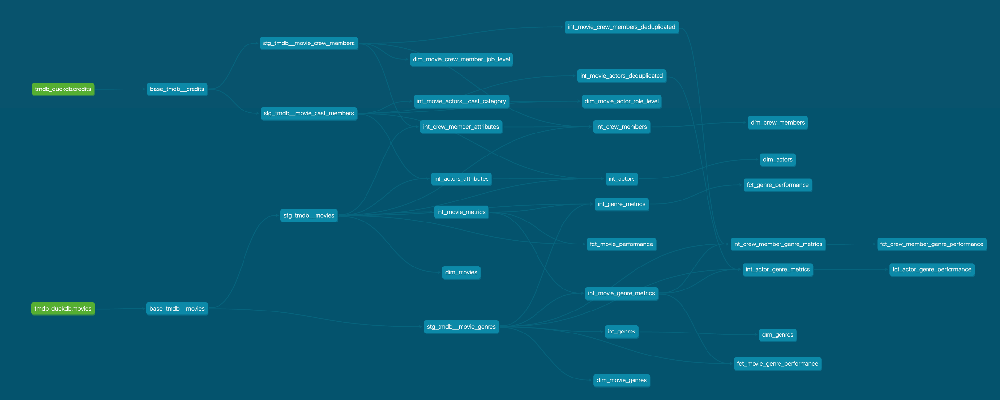

# Analytics Engineer Coding Exercise

Hi there! Thanks for reviewing this technical test and sharing your feedback. I will walk you through the decisions and reasoning I made to come up with the structure of this dbt project.

## Preliminary data exploration

- There are two datasets, one for movies and another for credits. The dataset for movies contains attributes of the movies, while the one for credits contains data about the people working in the movies (crew and cast). The key between both datasets is `movie_id` (`id` in movies). There're no duplicated rows and the same movies are present in both datasets.

### movies dataset
- `original_title` contains special characters and given that we also have `title` in english, will model only the latter one.
- `genres` is an array containing all genres related to a movie. Each genre object within the array contains the id of the genre and its name. There're some movies with genre array empty.

### credits dataset
- `cast` is an array containing all characters in a movie. Each cast object within the array contains the name of the character and its order, the id of the actor, their name and gender. `credit_id` is the unique identifier for each object. The same actor can play many roles in a movie.
- `crew` is an array containing all crew members in a movie. Each crew object within the array contains the id of the crew member and their name, along with the job they performed in the movie, and the department the job was part of. `credit_id` is the unique identifier for each object. Simmilarly to the cast object, one crew member can perform many jobs in a movie.

## Implementation Details

This is a very straightforward implementation of a dbt project. The configuration is intentionally kept simple to allow
for easy setup and to focus on the modeling process itself.

While this approach is effective for smaller-scale use cases or local environments, I am aware that there are more scalable solutions for deploying dbt projects in production, such as containerizing the environment using Docker. These options offer better dependency management, scalability, and portability.

For the purposes of this test, I opted for a simpler approach to prioritize clarity and ease of review, while still reflecting best practices in terms of dbt model structuring, naming, data quality and code style.

## Data lineage - model architecture

Here's the representation of the dbt model dependencies:



### Staging layer

This layer would have as many folders as data origins we might have.
So, at the same level of `tmdb`, one might have an `instagram` folder if we were tracking interactions on social networks for actors and crew members to measure their popularity.

#### Base

Since much of the relevant data is nested in the two datasets, I used this layer to differentiate raw sources from the actual entities that will be produced in staging, and that will serve as building blocks for the marts layer. Using also this layer to rename and cast fields. Models in this folder will be materialized as ephemeral by default.

#### Staging

Materialized as views by default. Instead of keeping a strict 1:1 relationship to the sources, I opted to state each one of the entities that will act as building blocks for the marts layer. For time efficiency, I focused on *genres, movies, cast and crew*, leaving out other entities that seem relevant like production companies.

When data cleaning is needed, to remove test data for instance, I'd implement a cleaning subfolder inside staging and place those models as parents of the staging ones.

If data volume is large, the staging models could be materialized as tables. `stg_tmdb__movie_cast_members`
would be a good candidate to be materialized as table because it is expected to have a big volume of rows.

I decided not to document every column at this stage, but instead leave it to the `marts` folder. However, I do test expected primary keys. This is helpful when debugging, a fast check is looking for duplicates in `marts` models and their parent `staging` ones, to see if the duplicates are more likely to come from the raw source or were generated during transformation in `marts` or `int` steps.

The naming convention here is `stg_<source>__<entity_combination>`

### Intermediate

Materialized as ephemeral, this folder is used to perform more complex transformations, such as:
- Applying business logic
- Joining different entities
- Performing aggregations at different levels to ease the Data Analysts quest of the most suitable crew and cast for the next hit.

Here I used a naming conversion like `int_<entity_combination>_<transformation>`.

This layer is structured into two sub-folders, making it easier to explore and maintain as models grow. Documentation here is kept minimal, with brief descriptions explaining what each model does. Xince these models are ephemeral, this is helpful for understanding their purpose.

### Marts

Materialized by default as tables, this layer is intended for end-users.
All the columns in marts models are documented to make definitions accessible and enable users to self-serve as much as possible.

In case of not having a native primary key, a surrogate key could be created using the `dbt_utils` package.

The fields to expose in the final select of marts models are explicitly stated. This is helpful to keep only relevant data and avoid ambiguous references when end users query the data and perform joins.

As in the intermediate layer, this folder is splitted by topics/domains to keep it in order while more models are added. So, at the same level of the `people` folder we could have another folder called `production_companies`.

The core entity is *movie* as it articulates all other entities and the other entities will inherit the metrics like `vote_count`, `popularity`, etc. from this central piece. We have a dim model for each entity (genre, movie, actor and crew member), and the combinations movie x genre, movie x actor x character and movie x crew member x job.

Assuming this is a huge dataset, the dim models with higher granularity are materialized as incremental using the append (default) strategy with no additional conditions to handle schema changes. I chose this
configurations because it's not expected that the crew members/actors disappear or change their job/role
from an already released movie. In case of fields renaming a full refresh will be necessary.

Since this is a static dataset, the fact models focus on performance metrics
of the entities compared to different subsets of data, like number of movies an actor has appeared in within the top 25 most popular movies per genre.

This could go further, for instance, having metrics at genre, actor and cast category level, to identify the best performing actors playing lead characters for a given genre.

I imagine having daily updates on the movie metrics like popularity and having a fct_table to record the evolution in time of each movie (in that case, it'd be a good candidate for incremental materialization).

## Using the marts layer

This example shows how to get the top 5 directors with the most movies in the top 25
highest-rated Science Fiction films, provided they have directed at least one movie in the past 10 years

```
--let's find the top 5 most successful directors for ficiton movies in the past 10 years

with fiction_directors as (

    select distinct
        crew_member_id,
        dim_movie_genres.genre_id

    from dbt_spena_marts_people.dim_movie_crew_member_job_level
    left join dbt_spena_marts_movies.dim_movie_genres
        on dim_movie_genres.movie_id = dim_movie_crew_member_job_level.movie_id
    left join dbt_spena_marts_movies.dim_genres
        on dim_genres.genre_id = dim_movie_genres.genre_id
    where job = 'Director'
    and dim_genres.genre_name = 'Science Fiction'

)

select fct_crew_member_genre_performance.*
from fiction_directors
left join dbt_spena_marts_people.fct_crew_member_genre_performance
using (crew_member_id, genre_id)
where latest_release_date_in_genre between '2007-02-03' and '2017-02-03'
order by n_movies_in_top_25_rated_by_genre desc, latest_release_date_in_genre desc
limit 5;
```